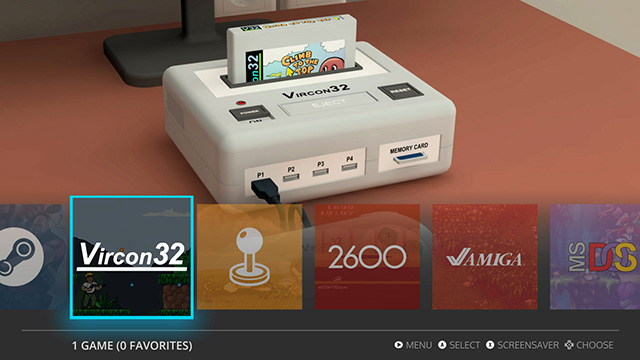
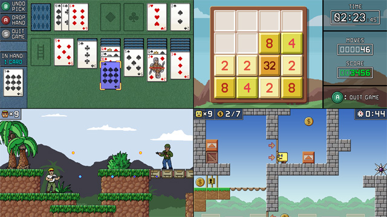

# Vircon32: Computer software

This is one of the GitHub repositories for Vircon32. This here is a general repository containing source code related to Vircon32 implementation, this is, software that does NOT run in the console itself but in an external computer or device.

----------------------------------
### What is Vircon32?

Vircon32 ([website here](https://www.vircon32.com)) is a 32-bit virtual game console. It was designed from scratch with the intent of being as simple as possible but still offer decent capabilities for retro, arcade-style games. Vircon32 is an open project: anyone can make their own emulators, games or tools. And the console has already been integrated into several emulation front-ends, like EmulationStation as shown here.

### What can it do?
On terms of power and features it is roughly in the same level as the 32-bit era home consoles like PSX and Saturn. But for simplicity this console is limited to 2D only, since even a basic 3D engine would add significant complexity to the console design and game programming.

These are the basic console specs:

- **Screen:** Resolution of 640x360 pixels, 16:9. True color.
- **Graphics:** Support for transparencies, rotation and scaling.
- **Sound:** 16 sample-based channels with CD quality sound.
- **Gamepads:** D-Pad and 6 buttons + start. 4 gamepad ports.
- **Saving:** Supports game saving via 1 MB memory cards.
- **Memory:** 16 MB RAM, with games up to 2.5 GB.

Here are some screenshots for you to have a quick idea.

For more details about the console, or the Vircon32 project in general, you can visit its website [www.vircon32.com](https://www.vircon32.com "Vircon32 Homepage") for more information. There you will also find everything you may need to try out the console and to make games for it.

----------------------------------
### What is included here?

This repository will include:
- Emulator for desktop PC
- Development tools (assembler, C compiler, file importers)
- Any future emulators (for Raspberry Pi, etc)
- Other tools (texture region editor, etc)
- The C compiler's standard library
  (it DOES run on the console, but it is part of the compiler)

However, it does not include console software such as the following:
- Games and demos
- Examples and tutorials
- The BIOS

Most of these projects are written in C++ version 2011, and use portable libraries (SDL, OpenGL, OpenAL) along with CMake in an attempt to support multiplatform compilation.

----------------------------------
### License

This repository contains several elements, so any of them might have their own license. But unless otherwise specified, the global license is:
- Software is provided under the [3-Clause BSD License](https://opensource.org/license/bsd-3-clause).
- Assets and documents are provided under [CC BY 4.0 License](https://creativecommons.org/licenses/by/4.0/)

The intent of Vircon32 is to be open and free, that is why the chosen licenses are very permissive and should allow most uses.

--------------------------------------------
### How to build these programs from source?

All C++ projects in this repository are prepared to compile using CMake. The CMake scripts do try to support (at least) building under Windows, Linux and Mac. Note that, under Windows, CMake defaults to building with Visual C++, but this is currently untested. To instruct CMake to build with MSYS2+MinGW, open a MinGW32 console and go to your desired build directory. Then use the command: `cmake -G 'MSYS Makefiles' <project's root CMake folder>`. For example, if you are at the project's root folder (i.e. the folder with the main CMakeLists.txt file) you could write these commands to make the build in a temporary folder and then install the software:

1. `mkdir build` to create a folder for your build
2. `cd build` to enter the build folder
3. `cmake -G 'MSYS Makefiles' ..` to have CMake configure the project for MinGW 
4. `make` to build the project
5. `cmake --install .` to install the built software

At that point, if no errors happened, your programs should be installed and able to run correctly. Install folder will be named "Vircon32" and placed in your system's default program path. You can then delete the temporary 'build' directory: it is no longer needed.

--------------------------------------------
### Dependencies on other libraries

To correctly build the software in this repository you will need to have at least the following libraries available in your build system. Note that these may in turn have dependencies themselves, which you will also need.

##### General purpose libraries:
* SDL2

##### Video libraries:
* OpenGL
* LibPNG

##### Audio libraries:
* OpenAL
* ALUT / FreeALUT

These programs also use 4 other libraries that are already included in the sources as external libraries: tinyxml2, osdialog, imgui and glad.
